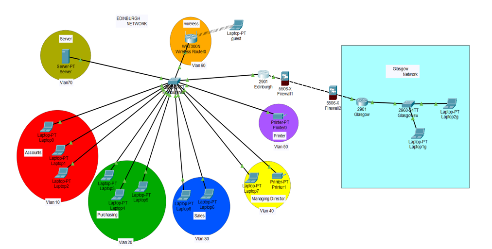
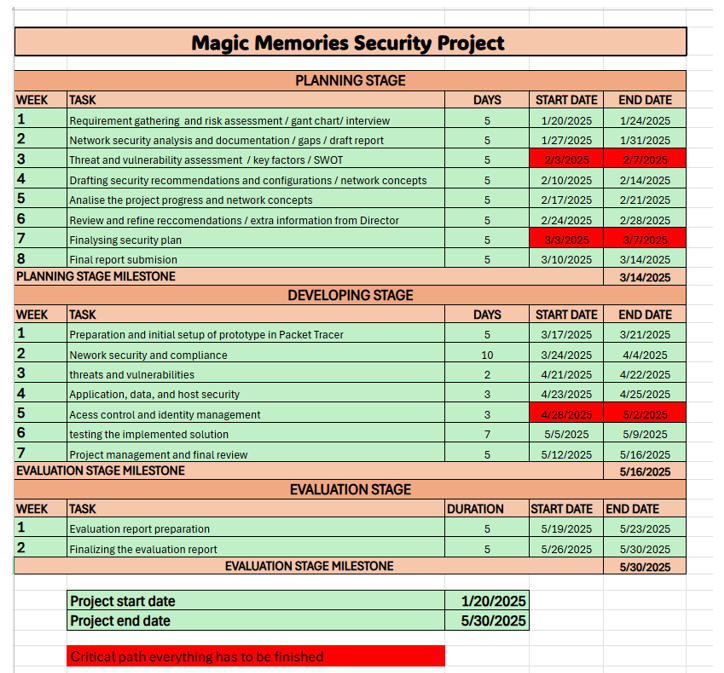
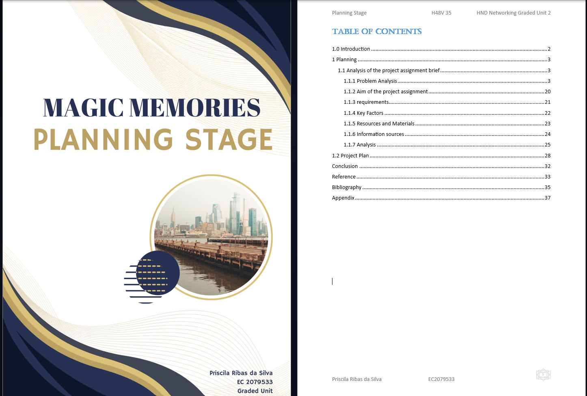
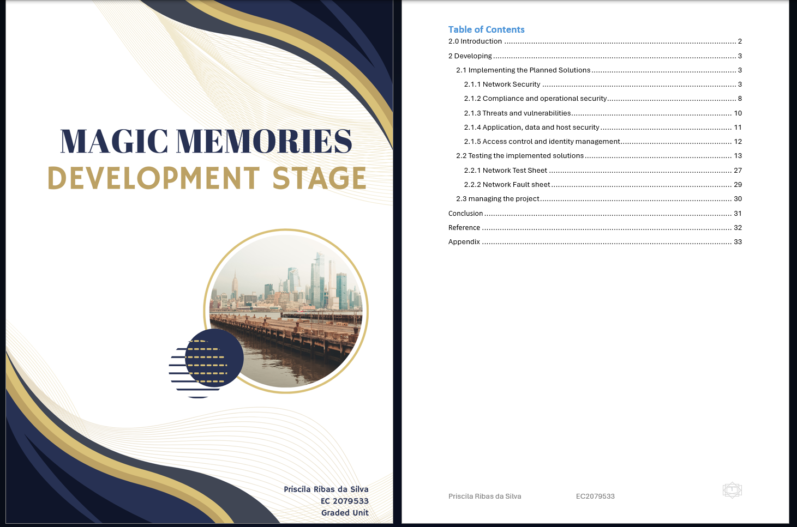
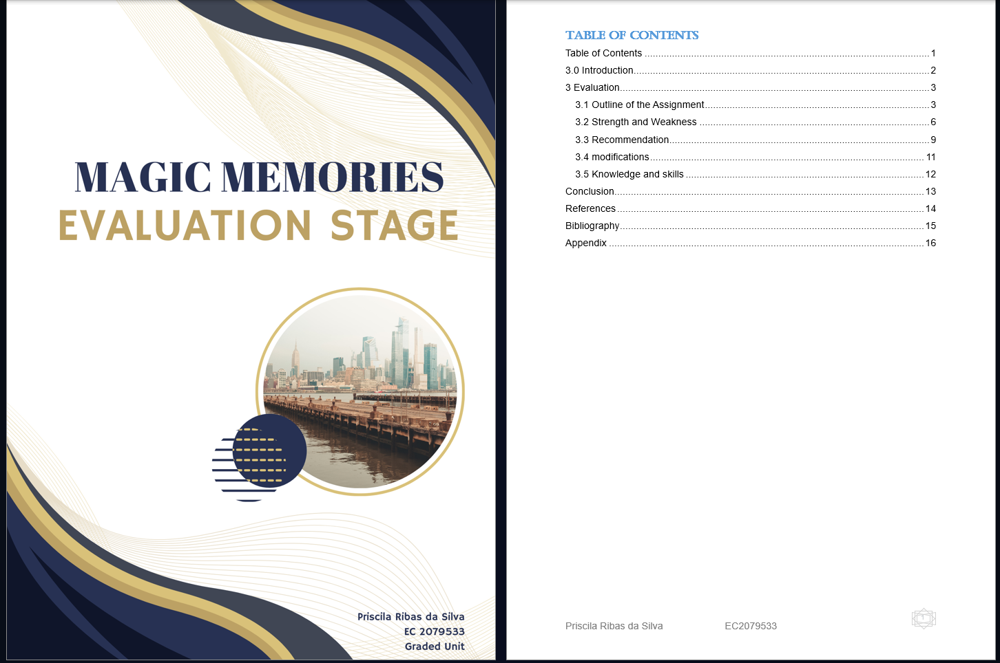

<!DOCTYPE html>
<head>
</head>
<body>
<h1>Capstone Project: Securing a Small Business Network </h1>
  
<h2>Project Objective</h2>

The objective of this four-month capstone project was to secure a small business network across all critical areas, including network security, compliance and operational security, threats and vulnerabilities, application, data and host security , and access control and identity management. The project involved planning, development, and evaluation phases, producing nearly 20,000 words of documentation.

<h2>Tools Used</h2>
<ul>
    <li>Cisco Packet Tracer for network simulation and testing.</li>
    <li>VMware to create virtual computers for testing.</li>
    <li>Windows operating system as the main platform for the project.</li>
    <li>Word and Excel for documenting findings and creating reports.</li>
    <li>Antivirus software to detect and prevent malware.</li>
    <li>PuTTY for secure remote access.</li>
    <li>Kali Linux for penetration testing.</li>
    <li>Wireshark for network traffic analysis.</li>
    <li>Firewall (pfSense) for network protection and segmentation.</li>
</ul>

<h2>Skills Gained</h2>

This project strengthened my abilities in problem-solving, troubleshooting, network configuration, acls and firewall setup, identity management, and vulnerability assessment. I also developed strong planning and documentation skills.

<h2>Outcome</h2>

The project delivered a secure, efficient network infrastructure, protecting the business from common threats and supporting future growth. The Managing Director's concerns were addressed with detailed security recommendations and practical implementations.

<h2>Project Images</h2>

<h3>Network Design</h3>

This image shows the network design created using Cisco Packet Tracer.

<h3>Gant Chart</h3>

Screenshot showing the Gant chart for the project.

<h3>Project Planning</h3>

Project Planning screenshot.

<h3>Project Development</h3>

Project Development screenshot.

<h3>Project Evaluation</h3>

Project Planning screenshot.

</body>
</html>
